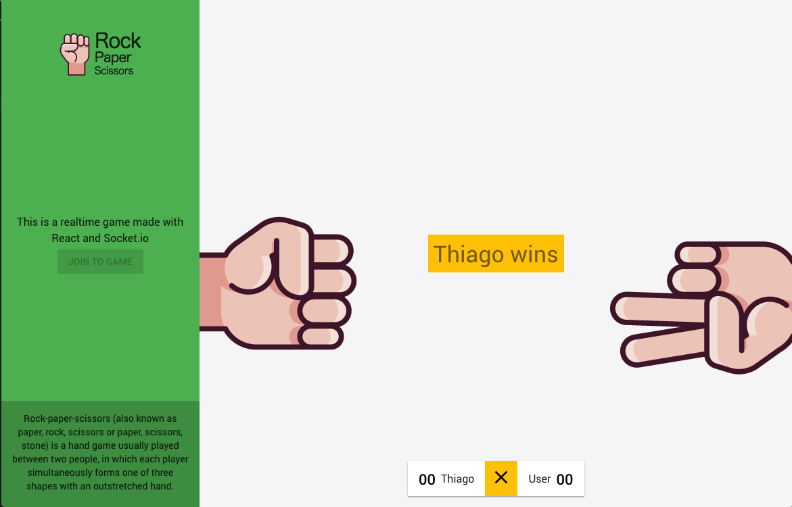

## React Rock/Paper/Scissors online game


---

This sample demonstrates the usage of React with socket to create a realtime game.

##[WIP]

This applications is still in development so few free to contribute.  


## Screenshot



## TODO
 - Refactor the node server (link)[https://github.com/thiagoterleski/server-react-online-game-rock-paper-scissors]
 - Unit tests
 - Score functionalities
 - Multiple rooms (current support only two players)
 - Animations
 - Responsible layout

 ---

 # Get started

 *Run the server first*

 ```
 $ git clone https://github.com/thiagoterleski/server-react-online-game-rock-paper-scissors
 $ cd react-realtime-tower-server
 $ yarn install
 $ node app.js
 ```

 *Run the application*
 ```
 $ git clone https://github.com/thiagoterleski/react-online-game-rock-paper-scissors
 $ cd react-marvel-catalog
 $ yarn install
 $ yarn start
 ```

 This sample was made with *Create React App* [(more information)](https://github.com/facebookincubator/create-react-app/issues/new) see the doc for requirements.
